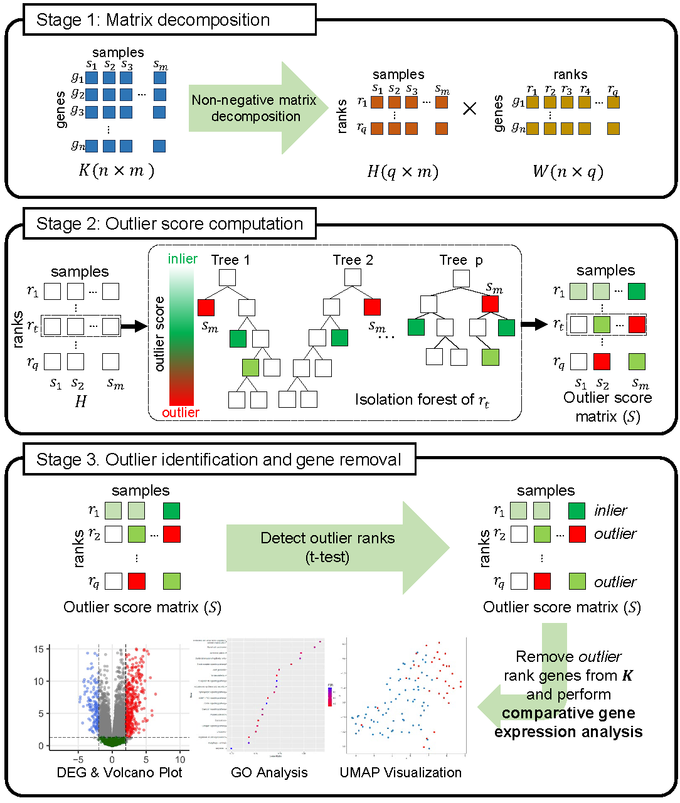

# DenoiseIt: Denoising Gene Expression Data using Rank based Isolation Trees
Gene expression analysis is a fundamental aspect of transcriptomic research, providing valuable insight into various biological processes and disease mechanisms. Especially, the differentially expressed genes (DEG) between two or more groups are of interest. It is a common practice to perform DEG analysis on a set of genes that are manually curated or collected by some gene selection method.
The DenoiseIt (Denoising Gene Expression Data using Rank based Isolation Trees) method builds on the hypothesis that samples belonging to a common group, in terms of clinical or biological characteristics, should exhibit similar gene expression patterns. Here, we also assume that the group label of each sample are given, while they are only used for performance evaluation and not used during the gene removal process.

Below is an illustration of the analysis workflow of MONTI.

  

